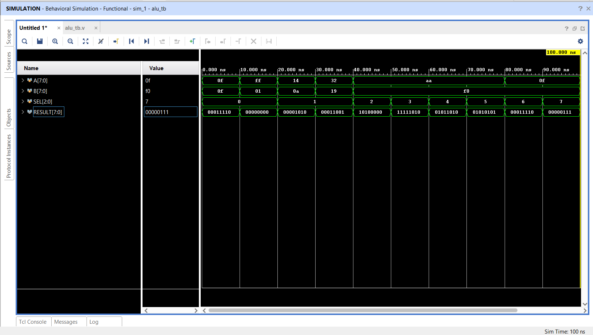
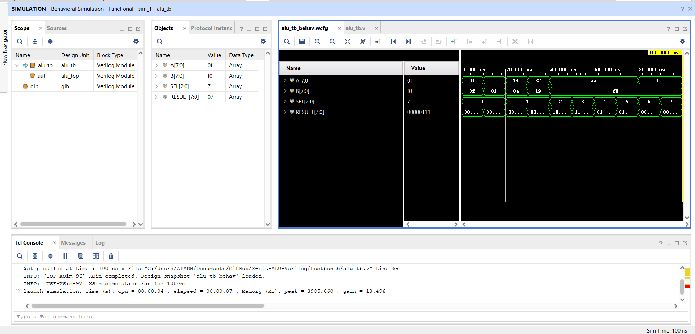
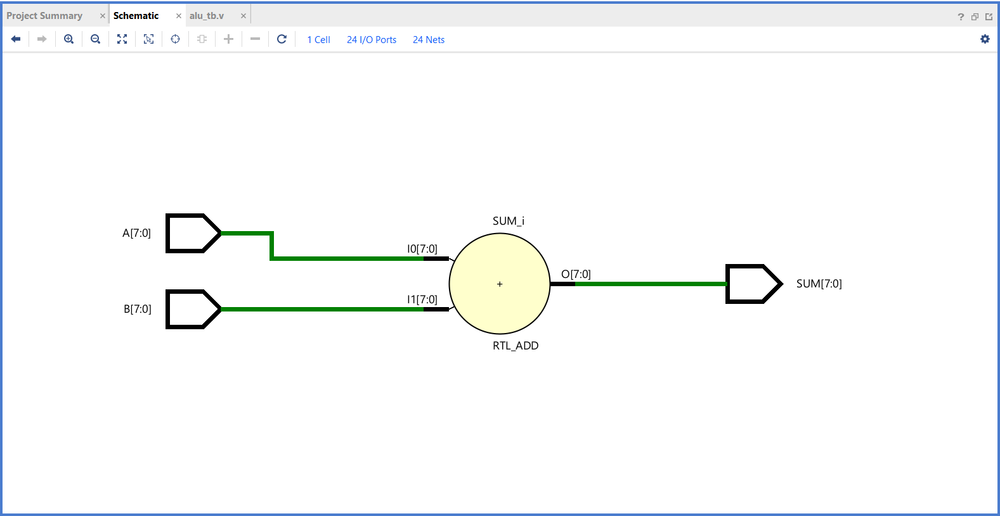
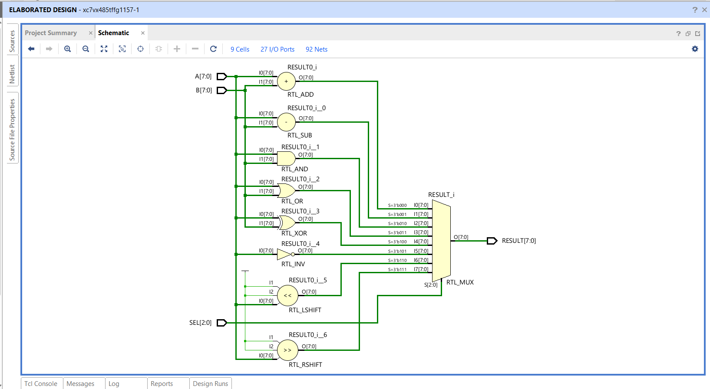

# 8-Bit ALU Design Using Verilog HDL

## Project Overview

This project implements an **8-Bit Arithmetic Logic Unit (ALU)** using **Verilog HDL**. The ALU performs arithmetic, logical, and shift operations based on a 3-bit select signal (`SEL`). The design was functionally verified using **Xilinx Vivado** through simulation and waveform analysis.

---

## Features

The ALU supports the following operations:

| SEL | Operation           |
| --- | ------------------- |
| 000 | Addition (A + B)    |
| 001 | Subtraction (A - B) |
| 010 | Bitwise AND         |
| 011 | Bitwise OR          |
| 100 | Bitwise XOR         |
| 101 | Bitwise NOT         |
| 110 | Left Shift          |
| 111 | Right Shift         |

---

## Tools Used

* Verilog HDL
* Xilinx Vivado 2025.2
* GitHub
* Windows 11

---

## Project Structure

```text
8-bit-ALU-Verilog/
│
├── src/
│   ├── adder.v
│   ├── subtractor.v
│   ├── and_gate.v
│   ├── or_gate.v
│   ├── xor_gate.v
│   ├── not_gate.v
│   ├── shifter.v
│   └── alu_top.v
│
├── testbench/
│   └── alu_tb.v
│
├── images/
│   ├── block_diagram.png
│   ├── waveform_simulation.png
│   ├── test_vectors_waveform.png
│   ├── rtl_schematic.png
│   └── adder_rtl.png
│
├── report/
│   └── project_report.pdf
│
└── README.md
```

---

## Block Diagram

The ALU accepts two 8-bit inputs (`A` and `B`) and a 3-bit select signal (`SEL`). Based on the select signal, the ALU performs the selected operation and generates an 8-bit result.


---

## Inputs and Outputs

### Inputs

| Signal | Width | Description      |
| ------ | ----- | ---------------- |
| A      | 8-bit | First Operand    |
| B      | 8-bit | Second Operand   |
| SEL    | 3-bit | Operation Select |

### Output

| Signal | Width | Description |
| ------ | ----- | ----------- |
| RESULT | 8-bit | ALU Output  |

---

## Verilog Modules

The design follows a modular approach.

### Modules

* adder.v
* subtractor.v
* and_gate.v
* or_gate.v
* xor_gate.v
* not_gate.v
* shifter.v
* alu_top.v

The top-level module (`alu_top.v`) integrates all submodules and selects the desired operation according to the value of `SEL`.

---

## Testbench Verification

A dedicated testbench (`alu_tb.v`) was created to verify the functionality of all ALU operations.

### Test Vectors

| Test No. | A   | B   | SEL | Operation   | Expected Output |
| -------- | --- | --- | --- | ----------- | --------------- |
| 1        | 15  | 15  | 000 | ADD         | 30              |
| 2        | 255 | 1   | 000 | ADD         | 0 (overflow)    |
| 3        | 20  | 10  | 001 | SUB         | 10              |
| 4        | 50  | 25  | 001 | SUB         | 25              |
| 5        | 170 | 240 | 010 | AND         | 160             |
| 6        | 170 | 240 | 011 | OR          | 250             |
| 7        | 170 | 240 | 100 | XOR         | 90              |
| 8        | 170 | X   | 101 | NOT         | 85              |
| 9        | 15  | X   | 110 | LEFT SHIFT  | 30              |
| 10       | 15  | X   | 111 | RIGHT SHIFT | 7               |

---

## Simulation Results

Behavioral simulation was successfully performed in Vivado.

All operations produced the expected outputs.

### Waveform



### Test Vector Waveform



---

## RTL Schematic

### ALU RTL Schematic



### Adder RTL Schematic



---

## Observations

* Addition and subtraction operations produced correct arithmetic results.
* Logical operations (AND, OR, XOR, NOT) behaved as expected.
* Shift operations correctly shifted the input data by one bit position.
* The modular design improved readability and maintainability.
* Simulation results matched the expected outputs for all test cases.

---

## Applications

* Microprocessors
* CPUs
* Embedded Systems
* FPGA-Based Designs
* Digital Signal Processing
* Educational Digital Design Projects

---

## Conclusion

An 8-Bit ALU was successfully designed and verified using Verilog HDL. The ALU performs arithmetic, logical, and shift operations selected through a 3-bit control signal. Functional verification was completed through simulation and waveform analysis in Vivado.

This project demonstrates fundamental digital design concepts, modular hardware development, and verification techniques used in FPGA and ASIC design flows.

---

## Author

**Aparna Dubey**

B.Tech (Electronics and Communication Engineering)

Internship Project – Verilog HDL

2026
